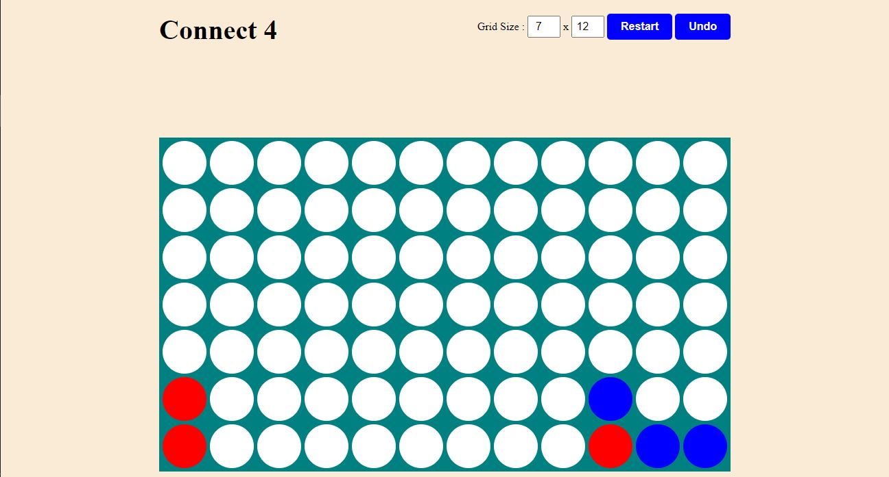

# [Connect-4 Game A.I. using minmax algorithm](https://connect-4-min-max.netlify.app/)

---

**A two player classic Connect-4 game made with vanilla JS ,html and css You play against A.I. that uses alphabeta pruning optimization of minmax algorithm to try to win the game.**

_You can checkout the game over [here](https://connect-4-min-max.netlify.app/)_

## RULES

-   The game ends when there is are 4 piece of same color adjacent to each other.
-   Adjacent means
    1. there can be 4 piece in a row next to each other
    2. there can be 4 piece in a column below each other or
    3. there can be 4 piece digaonaly

## ALGORITHM

The A.I. tries to maxmize the score while the player tries to minimize the score

the score is calculated by checking all the possible winning pairs(of 4) of the pieces and then
the depending upon the pieces that are already in the required

-   if 1 out of the 4 pieces are in position 1 point is given
-   if 2 out of the 4 pieces are in position 2 point is given
-   if 3 out of the 4 pieces are in position 5 point is given
-   if all 4 of the pieces are in position 10 point is given

The final score is calculated as ( AIscore - playerscore) which the A.I. tries to maximize
